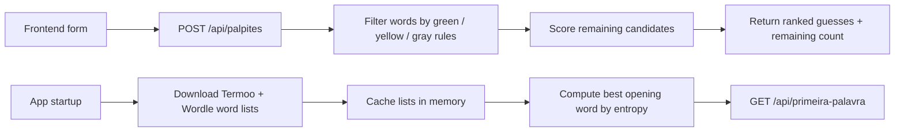

# TermoCerteiro Wordle Solver

<h1 align="center">
  <br />
  <a href="https://fastapi.tiangolo.com/" target="_blank" rel="noopener">FastAPI</a>
  |
  <a href="https://react.dev/" target="_blank" rel="noopener">React</a>
  |
  <a href="https://www.typescriptlang.org/" target="_blank" rel="noopener">TypeScript</a>
</h1>

<p align="center">
  
  
  
  
  
  
</p>

<h3 align="center">
  <a href="#about">About</a>
  <span> · </span>
  <a href="#stack-used">Stack used</a>
  <span> · </span>
  <a href="#architecture">Architecture</a>
  <span> · </span>
  <a href="#api">API</a>
  <span> · </span>
  <a href="#how-to-use">How to use</a>
  <span> · </span>
  <a href="#docker">Docker</a>
  <span> · </span>
  <a href="#testing">Testing</a>
  <span> · </span>
  <a href="#useful-links">Useful links</a>
</h3>

## About

This repository contains a bilingual helper for solving:

- `Termoo`, using a Portuguese 5-letter word list
- `Wordle`, using an English 5-letter word list

The project is split into a small FastAPI backend and a React frontend.

The backend:

- downloads the source word list for each game on startup
- keeps both word lists in memory
- computes the best opening word for each game using Shannon entropy
- filters remaining candidate words based on green, yellow, and gray letter constraints
- ranks candidate guesses using letter frequency, positional frequency, and letter uniqueness

The frontend:

- lets the player switch between `termoo` and `wordle`
- collects known correct letters, misplaced letters, and excluded letters
- shows the best first word for the selected game
- requests ranked suggestions from the API and renders the remaining candidate count

Important note:

- there is no database connection in this project
- there is no persistent storage layer
- caches live only in backend memory and are rebuilt when the API restarts

## Stack used

- <a href="https://fastapi.tiangolo.com/" target="_blank" rel="noopener">FastAPI</a>
- <a href="https://docs.pydantic.dev/" target="_blank" rel="noopener">Pydantic v2</a>
- <a href="https://www.python-httpx.org/" target="_blank" rel="noopener">httpx</a>
- <a href="https://pandas.pydata.org/" target="_blank" rel="noopener">pandas</a>
- <a href="https://react.dev/" target="_blank" rel="noopener">React 19</a>
- <a href="https://www.typescriptlang.org/" target="_blank" rel="noopener">TypeScript</a>
- <a href="https://vite.dev/" target="_blank" rel="noopener">Vite</a>
- <a href="https://tanstack.com/query/latest" target="_blank" rel="noopener">TanStack Query</a>
- <a href="https://react-hook-form.com/" target="_blank" rel="noopener">react-hook-form</a> with <a href="https://zod.dev/" target="_blank" rel="noopener">Zod</a>
- <a href="https://tailwindcss.com/" target="_blank" rel="noopener">Tailwind CSS 4</a>

## Architecture

The codebase is intentionally small and split by runtime responsibility.

| Area | Responsibility |
| --- | --- |
| `backend/main.py` | FastAPI app setup, CORS, lifespan startup, request/response models, route handlers |
| `backend/solver.py` | word loading, in-memory caches, filtering logic, scoring logic, entropy calculation |
| `frontend/src/pages` | page-level composition |
| `frontend/src/components/features` | domain UI for the solver form, best first word, and results |
| `frontend/src/services` | API calls to the backend |
| `frontend/src/types` | shared frontend request/response types |

### Solver flow



### Ranking model

For normal suggestions, the backend:

1. filters the full list using the current known constraints
2. computes global letter frequency across the remaining candidates
3. computes positional letter frequency for each of the 5 slots
4. scores each candidate using:

`score = character utility + letter uniqueness + optional grammatical weighting`

For the first move, the backend takes a different path:

- it evaluates every possible opening guess
- it computes Shannon entropy across the full word list
- it keeps the word with the highest expected information gain

## API

Main endpoints:

- `GET /health` returns API status plus loaded word-list counts
- `GET /api/primeira-palavra?game=termoo|wordle` returns the entropy-best opening word
- `POST /api/palpites` returns ranked guesses for the submitted constraints

Example request:

```sh
curl -X POST http://localhost:8000/api/palpites \
  -H "Content-Type: application/json" \
  -d '{
    "game": "termoo",
    "letras_corretas": ["", "", "", "", ""],
    "letras_existentes": ["r"],
    "letras_nao_existentes": ["a", "e"],
    "letras_nao_existentes_na_posicao": {
      "0": "r"
    },
    "n_palpites": 10
  }'
```

Example response shape:

```json
{
  "palpites": [
    { "palavra": "sopro", "score": 86.42 }
  ],
  "total_palavras_restantes": 17
}
```

## How to use

### Requirements

To run this project locally, you need:

- Python `3.11+`
- Node.js `20+`
- npm

### Step by step

1. Clone the repository

```sh
git clone <your-repo-url>
cd termocerteiro-wordle-solver
```

2. Set up the backend

```sh
cd backend
python3 -m venv .venv
source .venv/bin/activate
pip install -r requirements.txt
uvicorn main:app --reload --port 8000
```

3. In another terminal, set up the frontend

```sh
cd frontend
npm install
npm run dev
```

4. Open the app

```text
http://localhost:5173
```

### Frontend environment

The frontend points to `http://localhost:8000` by default.

If your API runs somewhere else, create a `.env` file inside `frontend/` and set:

```sh
VITE_API_URL=http://localhost:8000  
```

### Development notes

- The backend currently allows CORS from `http://localhost:5173` and `http://127.0.0.1:5173`.
- Startup may take a bit longer on the first run because the API downloads both word lists and computes the best opening word for each game.
- Since there is no database, restarting the backend clears every in-memory cache.

## Docker

If you only want to run the backend in a container, this repository now includes:

- [`backend/Dockerfile`](/Users/patrola/Desktop/patrola/personal/patrola/termocerteiro-wordle-solver/backend/Dockerfile)
- [`docker-compose.yml`](/Users/patrola/Desktop/patrola/personal/patrola/termocerteiro-wordle-solver/docker-compose.yml)

### Run with Docker Compose

From the repository root:

```sh
docker compose up --build -d
```

The API will be exposed on:

```text
http://localhost:8000
```

Useful commands:

```sh
docker compose logs -f backend
docker compose restart backend
docker compose down
```

### Run with plain Docker

Build the image:

```sh
docker build -t termocerteiro-backend ./backend
```

Run the container:

```sh
docker run -d \
  --name termocerteiro-backend \
  -p 8000:8000 \
  termocerteiro-backend
```

### VPS note

If you run this on a VPS and want to access it directly from outside the server, make sure:

- port `8000` is allowed in the VPS firewall or cloud firewall
- the container has outbound internet access, because startup downloads the Termoo and Wordle word lists
- if you prefer URLs without a visible port, place Nginx in front of the container and proxy a path such as `/api-termo/` to `http://127.0.0.1:8000/`

## Testing

There is currently no automated test suite committed to this repository.

Useful smoke checks:

```sh
cd frontend
npm run build
```

```sh
curl http://localhost:8000/health
```

Recommended future coverage:

- backend unit tests for `filtrar_palavras`, `calcular_padrao`, and `obter_palpites`
- frontend component tests for form input behavior and result rendering
- API integration tests for `/api/palpites` and `/api/primeira-palavra`

## Project structure

```text
backend/
├── main.py
├── requirements.txt
└── solver.py

frontend/
├── public/
├── src/
│   ├── assets/
│   ├── components/
│   │   ├── features/
│   │   └── ui/
│   ├── pages/
│   ├── services/
│   ├── types/
│   ├── utils/
│   ├── App.tsx
│   └── main.tsx
├── index.html
├── package.json
├── tsconfig.app.json
└── vite.config.ts
```

## Useful links

- [FastAPI documentation](https://fastapi.tiangolo.com/)
- [React documentation](https://react.dev/)
- [TanStack Query documentation](https://tanstack.com/query/latest)
- [Vite documentation](https://vite.dev/)
- [USP Portuguese word list](https://www.ime.usp.br/~pf/dicios/br-sem-acentos.txt)
- [Stanford / Knuth English word list](https://www-cs-faculty.stanford.edu/~knuth/sgb-words.txt)
